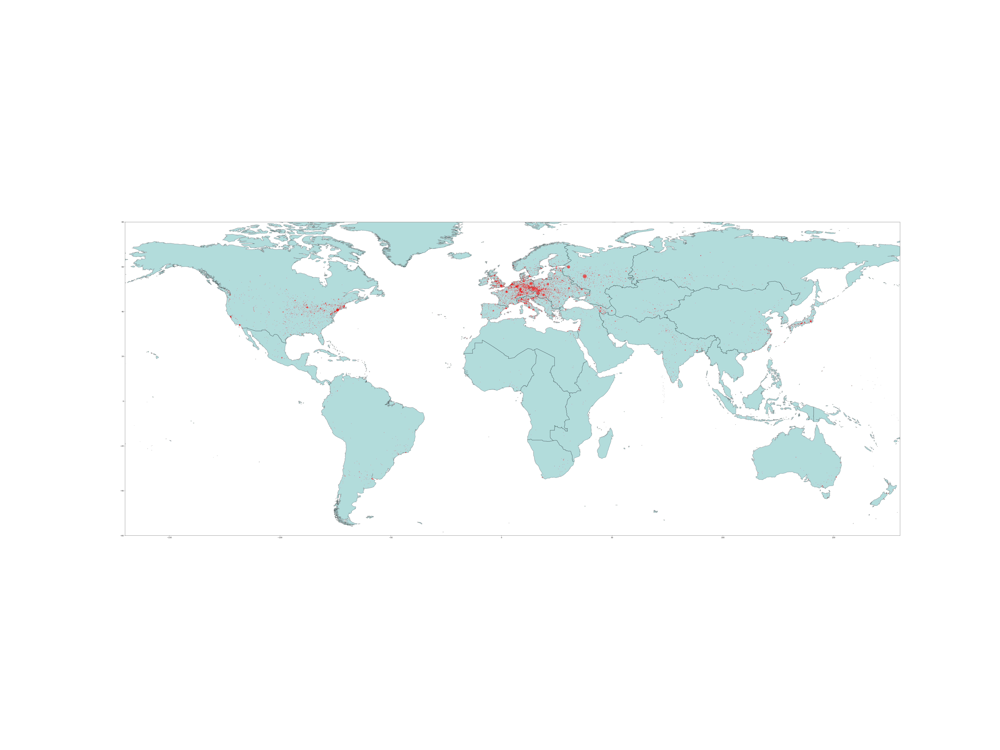
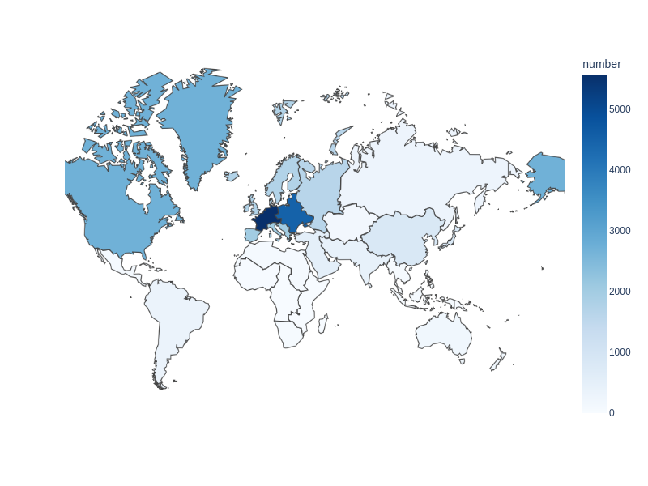
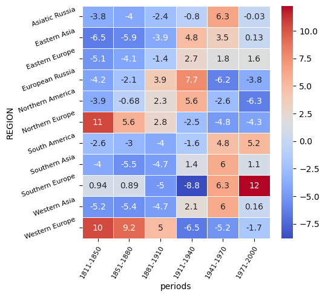

# Distribution dans le temps et dans l'espace des naissances de la population

## Effectifs par lieu de naissance

On observe un nette prépondérance des naissances en Europe et, dans une moindre mesure, aux Etats Unis.

## Carte choroplète

A l'aide d'une [carte choroplète](https://fr.wikipedia.org/wiki/Carte_choropl%C3%A8the) nous précisons notre analyse

De cette carte apparaît également la place important de la Russie dans ce domaine scientifique

## Distribution dans le temps

Grâce à une analyse bivariée des régions d'origine en relation avec les 'générations' (périodes de 30 ans) nous observons l'évolution dans le temps

* Apparaît de cette carte une forte prépondérance de l'Europe dans la première partie de la période observée.
* La Russie est quant à elle particulièrement présente dans les générations de 1881 à 1940.
* A noter le décollage de l'Asie après la Deuxième Guerre Mondiale ainsi que cleui de l'Europe méridionale et Amérique du Sud dans la dernière génération.